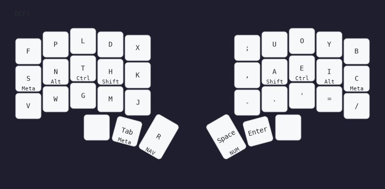

# zmk-conf

This is my personal ZMK firmware config for the [temper](https://github.com/raeedcho/temper).

## Flashing with nix-zmk

1. Run `udiskie` daemon for automount (optional)

```sh
udiskie &
```

1. Run `nix run .#flash` to flash firmware

```sh
cd ./path_to_this_repository
nix run .#flash
```

## Keymaps



## TODO
 - [ ] Dongle setup
 - [ ] Full keymaps

## Why 34?

[PSA: Thumbs can get overuse injuries](https://getreuer.info/posts/keyboards/thumb-ergo/index.html)

 ## Acknowledgements
- [Hands Down Promethium](https://www.reddit.com/r/KeyboardLayouts/comments/1g66ivi/hands_down_promethium_snth_meets_hd_silverengram/), base layout.
- [The T-34 keyboard layout](https://www.jonashietala.se/series/t-34)
- [raeedcho/temper](https://github.com/raeedcho/temper)
- [lilyinstarlight/zmk-nix](https://github.com/lilyinstarlight/zmk-nix)
- [urob/zmk-config](https://github.com/urob/zmk-config)
